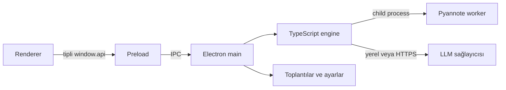
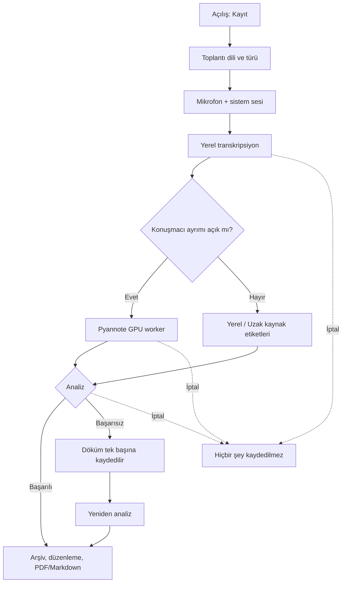

# Mimari

[← README](../README.md)

Argus, yerel ve tek kullanıcılı bir Electron uygulamasıdır. Rol, hesap ve sahte giriş
katmanı yoktur; uygulama doğrudan kayıt ekranında açılır.

## Süreç sınırları

| Katman | Sorumluluk |
|---|---|
| Renderer | Ses yakalama, kayıt ekranı, arşiv, düzenleme ve ayarlar |
| Preload | Renderer'a açılan dar ve tipli IPC sözleşmesi |
| Electron main | Dosya sistemi, pencere, güvenli ayar saklama, dışa aktarma ve engine koordinasyonu |
| Engine | Transkripsiyon, kaynak atfı, konuşmacı ayrımı ve analiz |
| Python worker | Pyannote çalıştırma; native runtime çakışmalarından ayrı süreçte tutulur |

Renderer'da Node entegrasyonu kapalı, context isolation açıktır. API anahtarının kendisi
renderer'a gönderilmez; yalnızca kayıtlı olup olmadığı ve maskeli son karakterleri görünür.

## Kullanıcı akışı

"Kaydı Bitir"den sonra çalışan bu hattın her aşaması onaylı bir iptalle durdurulabilir:
Pyannote süreci öldürülür, LLM isteği kesilir, geçici ses silinir ve toplantı arşive hiç
girmez. Analizin başarısız olması ise toplantıyı kaybettirmez — döküm asıl değerli ve
tekrarlanamaz yarıdır (ses o noktada silinmiştir), bu yüzden tek başına kaydedilir ve
arşivde "Analiz bekliyor" olarak işaretlenip yeniden analizle tamamlanabilir.

Kayıt, arşiv ve ayarlar aynı tek kullanıcı deneyimindedir. Ayarlar iki sekmedir:

1. Konuşmacı ayrımı ve konuşmacıların analize dahil edilmesi
2. Ollama/bulut/özel sunucu analiz sağlayıcısı

## Ses ve transkripsiyon

Renderer, mikrofonu ve Windows loopback sistem sesini ayrı akışlar olarak ölçer; engine'e
16 kHz mono PCM ile birlikte kaynak enerji zarfını gönderir. Kaynak zarfı, diarization
kapalıyken dahi konuşma turlarına `Yerel` veya `Uzak` etiketi verilmesini sağlar.

Whisper modelleri Transformers.js üzerinden ONNX Runtime ile yerel çalışır. Türkçe ve
yabancı dil akışları farklı model konfigürasyonları kullanır. Domain dictionary düzeltmesi,
seam dedup ve VAD transkripsiyon hattının ayrı aşamalarıdır.

## Analiz

Analiz katmanı tek bir sağlayıcı sözleşmesine sahiptir. Uzun dökümler parçalara ayrılır,
ara sonuçlar birleştirilir ve dokuz sabit bölüm üretilir. Sayısal değerler ile tarih/para/
yüzde gibi çapalar son çıktıya karşı tekrar doğrulanır.

## Yerel veri

Electron'ın `userData` dizini altında:

| Veri | Konum |
|---|---|
| Toplantılar | `meeting_recordings/` |
| Konuşmacı ayarları | `settings.json` |
| Analiz sağlayıcısı ve anahtar | `model-config.json` |

Geçici sesler sistem temp dizinindedir ve sonuç alındıktan önce silinir. API anahtarı
yalnızca main process tarafından okunur.

## Paketleme

Windows installer iki Whisper modelini ve Pyannote modelini taşır. CUDA runtime, NSIS
payload sınırı nedeniyle `Argus-GPU-Destegi.7z` adlı ayrı bir arşivdir ve Ayarlar'dan
kurulur. Runtime ayrı Python sürecinde çalışır; böylece Electron'ın ONNX native bileşeniyle
DLL/ORT çakışması oluşmaz.

## Kalite sistemi

`npm run test-run -w engine` tek senaryoyu, `npm run bench -w engine` tüm matrisi çalıştırır.
Her çıktı config ve metriklerini taşır. Referans seçimi klasör taramasıyla değil,
`control-group/control-group.md` registry'siyle yapılır; promote işlemi açık kullanıcı
onayı gerektirir.

## Dizinler

| Dizin | İçerik |
|---|---|
| `src/main` | Electron main, IPC, arşiv, ayarlar ve export |
| `src/preload` | Tipli renderer köprüsü |
| `src/renderer` | UI, kayıt ve düzenleme |
| `engine/transcribe` | Ses, VAD, Whisper, alignment ve dedup |
| `engine/diarize` | Pyannote worker ve süreç köprüsü |
| `engine/analyze` | Promptlar, bölümleme, grounding ve LLM istemcileri |
| `engine/live` | Canlı chunk kuyruğu ve finalization |
| `engine/bench`, `engine/test` | Regresyon ve gerçek senaryo araçları |
